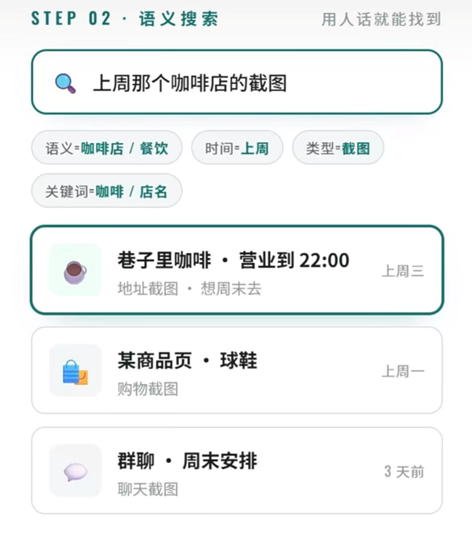

端侧智能体 - 应用类

端侧智能体应用类题目强调将智能体部署或运行在手机、平板、笔记本等端侧环境中，使其能够感知本地信息、理解用户意图，并完成具体任务闭环。
真实应用场景：解决学习、办公、健康、生活、隐私管理、环境感知等具体问题
智能体闭环：完成“感知 → 理解 → 规划 → 执行 → 反馈”的完整流程
可展示性：最终需要有清晰的 Demo，能够展示输入、智能体分析过程、工具调用过程和输出结果

支持结合云端API，但核心交互逻辑本地运行

个人相册整理智能体

题目描述：设计一个运行在端侧设备上的个人相册整理智能体。系统能够在本地分析用户相册中的照片和截图，完成自动分类、标签生成、事件聚合、重复照片清理建议和隐私内容提醒。
典型场景：
用户手机相册中有大量照片、截图、票据、聊天截图；
智能体自动识别照片内容生成标签或文本；
智能体生成相册整理建议，并支持用户搜索和批量删除。
基本要求：
图片内容理解：图像分类、OCR 、文本概述或简单标签生成；
整理策略生成：根据图片内容、时间、OCR 结果提出分类方案；
用户模糊检索：根据用户提出的文本检索相关图片。

一、项目目标
设计一个运行在端侧设备上的个人相册整理智能体。系统能够在本地分析用户相册中的照片和截图，完成自动分类、标签生成、事件聚合、重复照片清理建议和隐私内容提醒。

二、模块及基本要求
1. 图片内容理解：图像分类、OCR 、文本概述或简单标签生成
2. 整理策略生成：根据图片内容、时间、OCR 结果提出分类方案
3. 用户模糊检索：根据用户提出的文本检索相关图片
4. 前端交互界面：语音/文本输入框、照片展示、整理结果呈现、清理建议确认等
5. 端侧部署：模型的量化压缩与格式转换、推理框架集成、硬件加速调用（NPU/GPU）、各模块间通信调度、以及与前端的数据交互接口

四、工作计划

1. 搭整体框架（Kotlin+Android Studio），确定函数名、函数功能、函数接口、输入与返回